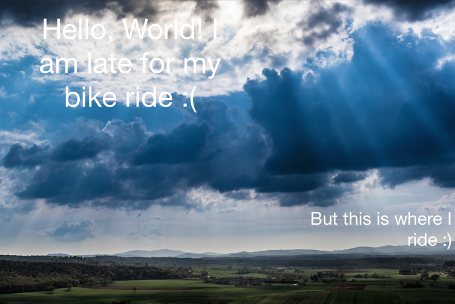
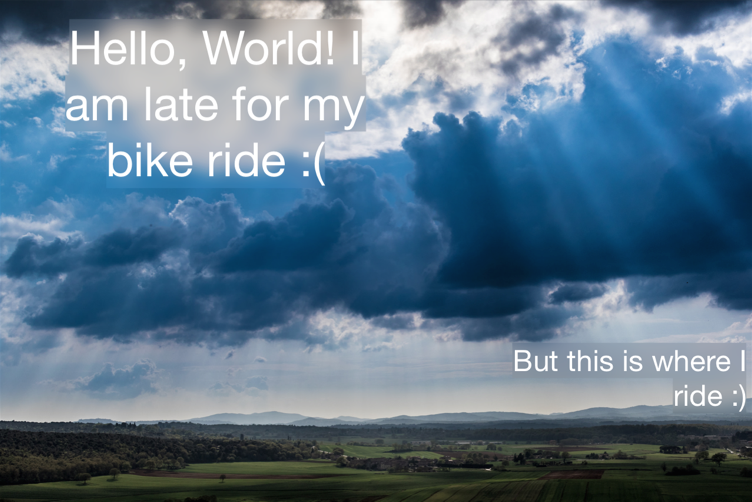

# RPClarity

RPClarity is a set of extensions, demonstrated in a swift playground that shows a technique for blurring an image behind the individual characters (glyphs) of one or more `UILabel`s in order to improve the contrast between text (often white) and the image behind the text.

## Background

Beautiful images are a major component of many apps, and it is very common to apply white text over top of an image. In cases where the image includes clouds or other light colored or high contrast (busy) elements, the text has insufficient contrast with the background and is hard to read.

### Low Contrast



Techniques for improving the readability of white text over an image often include putting a gradient or other layer between the text and the image to improve the contrast, therefore improving the readability. A major side effect of this approach is that the layer used to improve contrast is a fixed, rectangular size and is not adaptive to the specific (often dynamic) text, screen size and line wrapping of the layout.

e.g. The CSS [BackdropFilterProperty](https://drafts.fxtf.org/filters-2/#BackdropFilterProperty) supported by [WebKit](https://www.webkit.org/blog/3632/introducing-backdrop-filters/).

Unnecessarily obscuring an image where text does *not* exist defeats the investment in beautiful imagery.

Similarly, the entire image may be darkened, blurred or halftoned, but each of these approaches affects more of the image than may be necessary.

A compromise may be to apply a blur to the image only where the UILabel exists. For single lines of text that do not wrap, this may be an attractive improvement. However, if the contents of the UILabel happen to wrap, there is no need to blur areas within the bounding rectangle of the label that do not contain text.

```
The quick brown fox jumps over
the lazy dog
```

(If this ^ were a UILabel there would be no need to blur the image below the negative space to the right of `over` or `dog`.)

## Details

RPClarity attempts to optimize the application of a blur to specifically the areas underneath the glyphs, preserving the detail visible in other areas of the image.

### RPClarity Applied


RPClarity also allows for the edge of the blurred area to be feathered (default) or to have sharp edges.

### RPClarity with No Feather



The blurred area has a desaturation and tint color applied to generally improve the legibility of white text over white imagery.

This technique assumes a view hierarchy that includes a `UIImageView` as well as one or more `UILabel`s above it (in `z`). It then internally uses `NSTextStorage`, `NSLayoutManager`, `NSTextContainer` and an invisible `UITextView` to determine the line wrapping of the contents of the `UILabel` and apply a blur to the image *only* underneath the glyphs of the text of the UILabel. The blur can have sharp or soft (feathered) edges, and the blurred area can also have a tint applied in order to further increase contrast.

**Note:** RPClarity is not a high-performance solution (yet). It has not yet been subjected to performance analysis with Instruments and has known inefficiencies.
